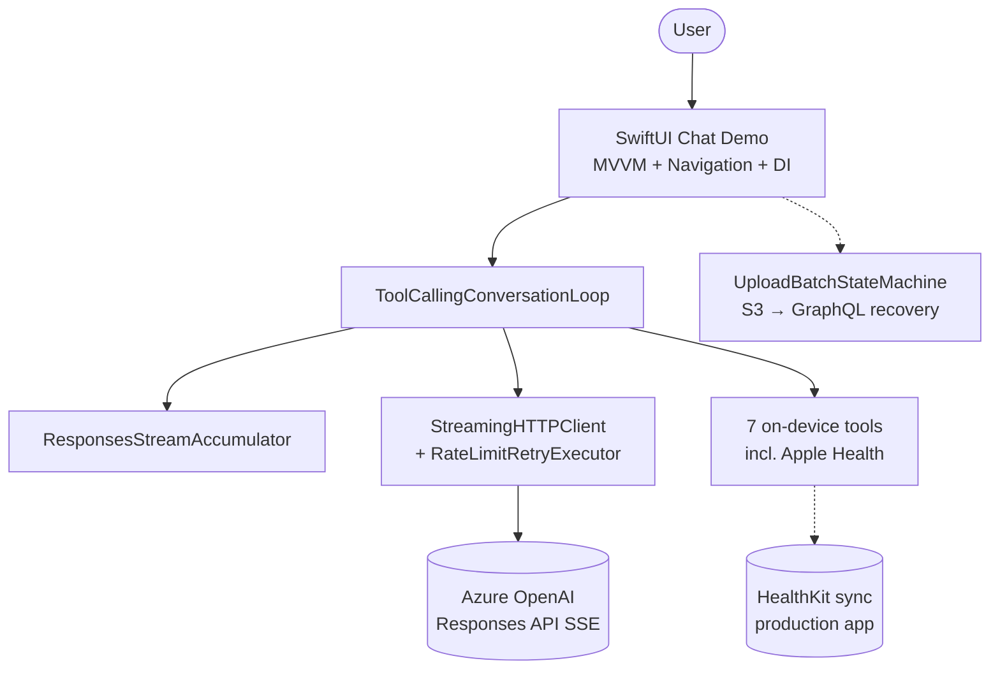
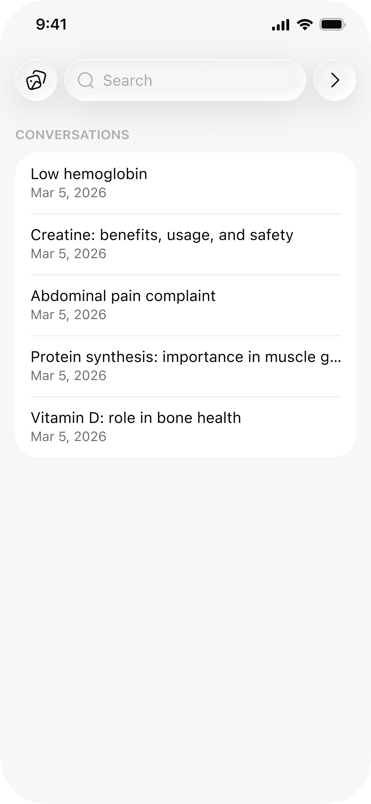
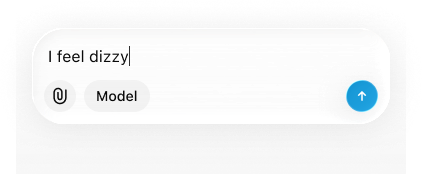
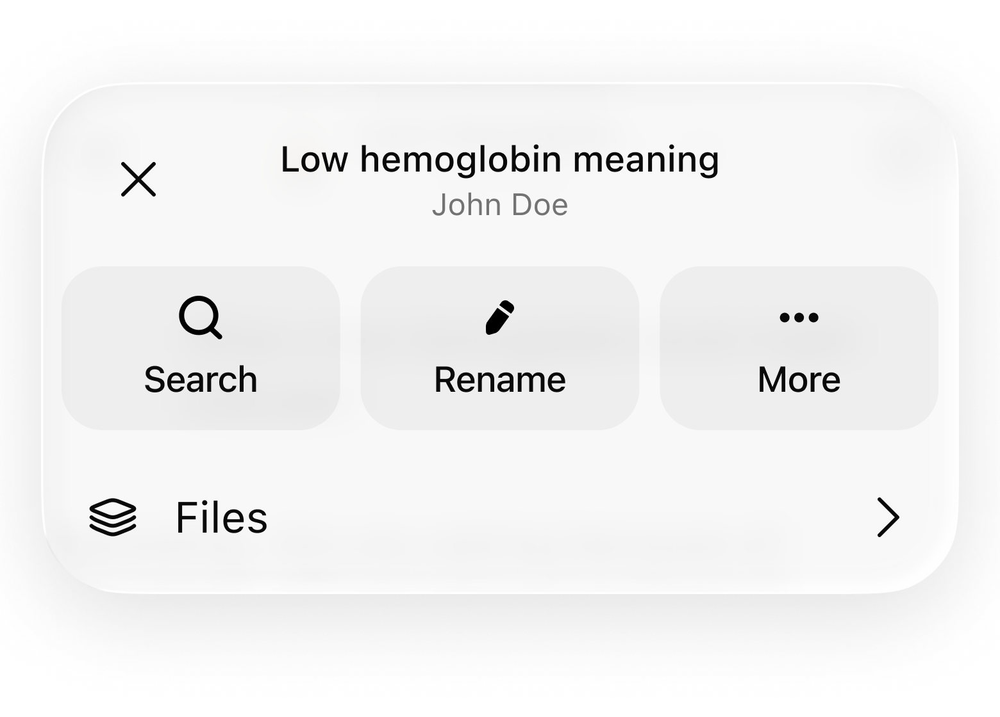
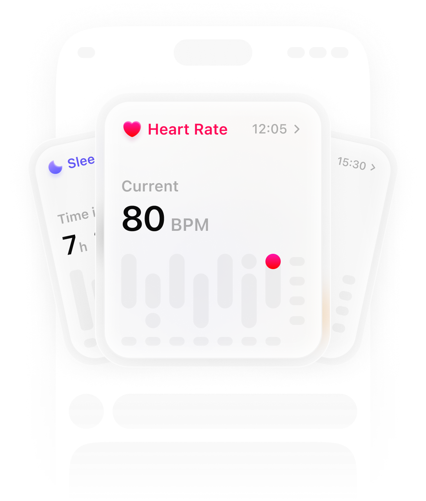

# SSEAIStreamingSample

Public Swift package + **SwiftUI demo app** with patterns from a shipped App Store health AI product — [**2ndOpinions**](https://apps.apple.com/us/app/2ndopinions/id6560104742).

Clean-room reference code (no API keys, no proprietary backend).  
Built by [Oleksandr Meteliev](https://github.com/Oleksandr19942).

---

## Architecture



**Text flow:**

```
User
  ↓
SwiftUI Chat (ChatDemoView / production ChatView)
  ↓
ToolCallingConversationLoop
  ↓
ResponsesStreamAccumulator + StreamingHTTPClient
  ↓
Azure OpenAI (SSE)
```

---

## SwiftUI demo app (iOS)

The repo is **not only** a core package — it includes a runnable UI sample:

📱 **[Examples/ChatStreamingDemo](Examples/ChatStreamingDemo)** — open `ChatStreamingDemo.xcodeproj` in Xcode 17+

Demonstrates what iOS hiring managers look for:

| Skill | Demo |
|-------|------|
| SwiftUI | Chat bubbles, tabs, forms |
| Navigation | `TabView` + `NavigationStack` |
| MVVM | `ChatDemoViewModel` |
| async/await | Streaming `send()` |
| Dependency Injection | `AppDependencies` |

Uses the local `SSEAIStreamingSample` package (mock SSE + Health tool loop).

---

## Production screenshots (2ndOpinions)

Real UI from the shipped app (not stock illustrations):

### Chat & streaming

<p align="center">
  
  
</p>

<p align="center">
  
  
</p>

### Apple Health & medical context in AI

<p align="center">
  
  
</p>

*Optional:* add `07-upload-recovery-sheet.png` from `FileUploadsSheetView` in the production app — see [docs/screenshots/README.md](docs/screenshots/README.md).

---

## Production patterns in the package

### 1. Responses SSE accumulator
`ResponsesStreamAccumulator` — Azure OpenAI **Responses API** stream events (deltas, tool calls, completion metadata).

### 2. Rate-limit resilient streaming
`RateLimitRetryExecutor` + `StreamingHTTPClient` — HTTP **429** backoff.

### 3. Tool-calling conversation loop
`ToolCallingConversationLoop` — `stream → tools (cached) → stream → final text`.

### 4. Apple Health ↔ AI
`AppleHealthAIToolDefinition`, `HealthDataDomain`, `SemanticSearchScope`, `AIToolCatalog` (7 tools).

Production flow: **HealthKit → sync payload → `GetLatestAppleHealthRecords` + `SemanticSearch(AppleHealth)`**.

### 5. Medical upload recovery
`UploadBatchStateMachine` — orphan jobs, in-flight GraphQL grace period, batch TTL pruning.

---

## Module map

| File | Responsibility |
|------|----------------|
| `ResponsesStreamAccumulator` | SSE → `StreamTurnResult` |
| `StreamingHTTPClient` | Bytes + 429 retry |
| `ToolCallingConversationLoop` | Multi-turn tool loop |
| `AppleHealthAIToolDefinition` | HealthKit → AI tool |
| `UploadBatchStateMachine` | Upload orphan recovery |
| `Examples/ChatStreamingDemo` | SwiftUI + MVVM demo |

---

## Requirements

- iOS 17+ / macOS 14+ (package)  
- Swift 5.9+  
- Xcode 15+ (demo app)

## Tests

```bash
swift test
```

15 tests — SSE, tool loop, Health tool definitions, upload recovery.

---

## Related

- [2ndOpinions on the App Store](https://apps.apple.com/us/app/2ndopinions/id6560104742)  
- [StartupSoft case study](https://www.startupsoft.com/cases/2nd-opinion/)  
- [Author GitHub profile](https://github.com/Oleksandr19942)

## License

MIT
